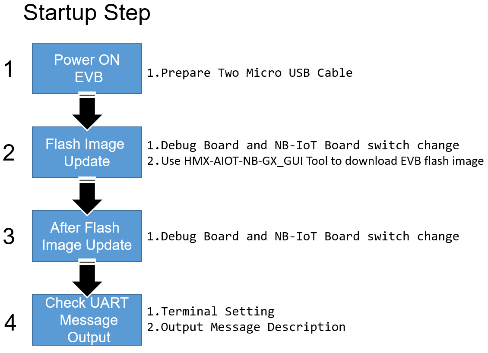
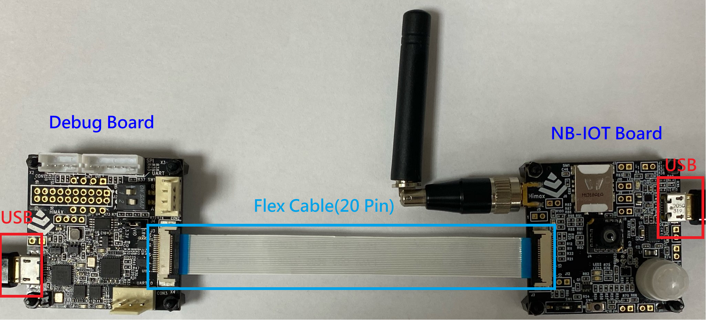

# Himax-AIoT-NB-G3 Platform EVB USER GUIDE

Himax-AIoT-NB-G3 Platform EVB includes Himax WE-I Plus MCU, image sensor and rich peripheral supports. The details are given in the following paragraph.

## Table of contents

- [Himax-AIoT-NB-G3 Platform EVB](#himax-aiot-nb-g3-platform-evb)
- [System Requirement](#system-requirement)
  - [Hardware Environment Setup](#hardware-environment-setup)
  - [Software Tools](#software-tools)
- [Himax-AIoT-NB-G3 Platform EVB Startup](#himax-aiot-nb-g3-platform-evb-startup)
  - [Startup Flowchart](#startup-flowchart)
  - [Power ON EVB](#power-on-evb)
  - [Flash Image Update](#flash-image-update)
  - [After Flash Image Update](#after-flash-image-update)
  - [Check UART Message Output](#check-uart-message-output)
- [Firmware Read Back Backup Flow](#firmware-read-back-backup-flow)
- [Operators Network Setup](#operators-network-setup)
- [Connect to Azure IoT Hub](#connect-to-azure-iot-hub)
  - [Connect Azure Device Provisioning Service and IoTHub Device](#connect-azure-device-provisioning-service-and-iothub-device)
  - [Send Algorithm Metadata](#send-algorithm-metadata)
  - [Send Image](#send-image)
  - [Send Algorithm Metadata and Image](#send-algorithm-metadata-and-image)
  - [Send Custom JSON Format Data](#send-custom-json-format-data)
  - [Enter Power Saving Mode](#enter-power-saving-mode)
  - [Azure RTOS Startup](#azure-rtos-startup)
- [TensorFlow Lite for Microcontroller Example](#tensorflow-lite-for-microcontroller-example)
  - [TFLM Model Path](#tflm-model-path)
  - [TFLM Example Person Detection INT8](#tflm-example-person-detection-int8)
- [Model Deployment Tutorial](#model-deployment-tutorial)

## Himax-AIoT-NB-G3 Platform EVB

  1.	Himax WE-I Plus chip
  2.  Himax Debug Board
  3.	HM0360 AoSTM VGA camera
  4.  Microphones (L/R) at back side
  5.	3-Axis Accelerometer
  6.	3-Axis Gyroscope
  7.	3-Axis Magnetometer
  8.	Reset Button
  9.	GREEN LED x2 and RED LEDx1 and BLUE LEDx1
  10.	Micro USB cable: Debug Board (I2C/SPI/Flash Download)

  <a href="docs/H013_HX6539_NB-IoT_1SC-DM_V10_20210622_BOM.pdf" target="_blank">Board Schematic PDF</a>

## System Requirement
  - Hardware Environment Setup
    - Prepare Two Micro USB Cable: connect to EVB (as Power/UART)

  - Software Tools
    - HMX-AIOT-NB-GX_GUI (I2C/CLK/SPI/Flash Image Download)
    - Serial Terminal Emulation Application
      - In the following description, [TeraTerm](https://ttssh2.osdn.jp/index.html.en) and [Minicom](https://linux.die.net/man/1/minicom)
        will be used.

## Himax-AIoT-NB-G3 Platform EVB Startup
  - Use the following procedure to startup the Himax-AIoT-NB-G3 platform EVB.

### Startup Flowchart

  

### Power ON EVB
Power supply by usb or battery(AAA*4)
 

### Flash Image Update
  - Before Power ON EVB
    - Step 1: NB-IoT board SW pin switch to ON
    - Step 2: Debug board SW pin 1 switch to OFF, pin 2 keep ON
    - NBIoT Board

    

    - Debug Board

    

  - After Power ON EVB
    - Use HMX-AIOT-NB-GX_GUI Tool update EVB flash image

  - Use HMX-AIOT-NB-GX_GUI Tool to download EVB flash image
    - Step 1: Open HMX-AIOT-NB-GX_GUI.exe and switch to Flash download page
    - Step 2: Read ID to check HW ready (ID info Show in blue box)
    - Step 3: Select correct image file
    - Step 4: Erase flash
    - Step 5: Programming data

    

### After Flash Image Update
  - NB-IoT board SW pin switch to OFF
  - Debug board SW pin 1 switch to ON, pin 2 keep ON
    - NB-IoT Board

    

    - Debug Board

    

### Check UART Message Output
  - Serial Terminal Emulation Application Setting

|   |  |
| :------------ |:---------------:|
| Baud Rate  | 115200 bps |
| Data | 8 bit |
| Parity  | none  |
| Stop  | 1 bit  |
| Flow control | none |

  The system will output the following message to the UART console. Please setup UART terminal tool setting as (115200/8/N/1).

  - Display Log Message
  In the example, we use TeraTerm to see the output message.

    - TeraTerm New Connection

    

    - TeraTerm Select COM Port

    

    - Connect DPS Log Message

    

    - Connect IoTHub Log Message

    

    - Run Person Detect Algorithm Log Message

    

  You can use the [Azure IoTHub Explorer](https://docs.microsoft.com/en-us/azure/iot-pnp/howto-use-iot-explorer) tool to see your metadata.
  As following image is simple demonstrate.
  Note: model id:`dtmi:himax:weiplus;2`

  

## Firmware Read Back Backup Flow
In this chapter, you can know how to firmware image read back backup flow.
- Before Power ON EVB
  - Step 1: NB-IoT board SW pin switch to ON
  - Step 2: Debug board SW pin 1 switch to OFF, pin 2 keep ON
- After Power ON EVB
  - Step 1: Open HMX-AIOT-NB-G2_GUI.exe and switch to Flash download page
  - Step 2: Read ID to check HW ready (ID info Show in blue box)
  - Step 3: Enter Start Addr `0x00000000` and Size `0x00200000`
  - Step 4: Read Back 

    

- Backup firmware image Path
Himax-AIoT-NB-G3-SDK-Azure-RTOS-main\HMX_AIOT-NB-GX_GUI\read_0000.bin

you can reference [`Flash Image Update`](https://github.com/HimaxWiseEyePlus/Himax-AIoT-NB-G3-SDK-Azure-RTOS/tree/main/Himax-AIoT-NB-G3_user_guide#flash-image-update) re-download `read_0000.bin` to EVB.

## Operators Network Setup
 Define as follows value in Himax-AIoT-NB-G3-SDK-Azure-RTOS-main\himax_aiot_nb_g3-master\app\scenario_app\hx_aiot_nb_g3\azure_iothub.c 
     #define ENABLE_OPERATORS_NETWORK_SETUP
Operators network setting in Himax-AIoT-NB-G3-SDK-Azure-RTOS-main\himax_aiot_nb_g3-master\external\nb_iot\type1sc\type1sc.h
	 #define OPERATORS_LPWAN_TPYE  <"choose support LPWAN for your SIM Card">
	 #define OPERATORS_APN		 <"choose support APN for your SIM Card">
	 #define OPERATORS_BAND        <"choose support BAND for your SIM Card">
Himax-AIoT-NB-G3-SDK default operators network setting as follows:
	 #define OPERATORS_LPWAN_TPYE   LPWAN_CATM1
	 #define OPERATORS_APN		 "\"internet.iot\""
	 #define OPERATORS_BAND		 LPWAN_BAND3
##  Connect to Azure IoT Hub
### Connect Azure Device Provisioning Service and IoTHub Device
   Define as follows value in Himax-AIoT-NB-G3-SDK-Azure-RTOS-main\himax_aiot_nb_g3-master\app\scenario_app\hx_aiot_nb_g3\inc\azure_iothub.h 
       #define AZURE_DPS_IOTHUB_STANDALONE_TEST 1
       #define ENDPOINT                        "global.azure-devices-provisioning.net"
       #define HOST_NAME                       <"Key-in your HOST_NAME">
       #define REGISTRATION_ID                 <"Key-in your REGISTRATION_ID">
       #define ID_SCOPE                        <"Key-in your ID_SCOPE">
       #define DEVICE_SYMMETRIC_KEY            <"Key-in DEVICE_SYMMETRIC_KEY">
      
more information please reference the file:  
<a href="docs/himax_WEI_Azure_RTOS_Device_getStartedDoc.pdf" target="_blank">himax_WEI_Azure_RTOS_Device_getStartedDoc</a>
      
## Send Algorithm Metadata
    - Algorithm Metadata structure(sample)
     - humanPresence : 1(detect human) , 0(no human)
     - upper_body_bbox.x : bounding box x-axis for detected human.
     - upper_body_bbox.y : bounding box y-axis for detected human. 
     - upper_body_bbox.width : bounding box width for detected human.
     - upper_body_bbox.height : bounding box height for detected human.
    - Change [azure_active_event]  value  in void tflitemicro_start() at Himax-AIoT-NB-G3-SDK-Azure-RTOS-main\himax_aiot_nb_g3-master\app\scenario_app\hx_aiot_nb_g3\hx_aiot_nb_g3.c  
     - azure_active_event = ALGO_EVENT_SEND_RESULT_TO_CLOUD;
     
## Send Image
    - Change [azure_active_event] value in void tflitemicro_start() at Himax-AIoT-NB-G3-SDK-Azure-RTOS-main\himax_tflm-master\app\scenario_app\hx_aiot_nb\hx_aiot_nb.c  
     - azure_active_event = ALGO_EVENT_SEND_IMAGE_TO_CLOUD;

## Send Algorithm Metadata and Image
    - Change [azure_active_event] value in void tflitemicro_start() at Himax-AIoT-NB-G3-SDK-Azure-RTOS-main\himax_aiot_nb_g3-master\app\scenario_app\hx_aiot_nb_g3\hx_aiot_nb_g3.c  
     - azure_active_event = ALGO_EVENT_SEND_RESULT_AND_IMAGE;

## Send Custom JSON Format Data
    - You can send custom json format data to the cloud through send_cstm_data_to_cloud(unsigned char *databuf, int size, uint8_t send_type)
    - unsigned char *databuf: data buffer, data must be json format.
    - int size: data size.
    - uint8_t send_type : Select SEND_CSTM_JSON_DATA

## Enter Power Saving Mode
 Himax-AIoT-NB-G3-SDK-Azure-RTOS-main\himax_aiot_nb_g3-master\app\scenario_app\hx_aiot_nb_g3\azure_iothub.c 
    - #define ENABLE_PMU
## Azure RTOS Startup
  - More detail information please reference [here](https://github.com/azure-rtos)

## TensorFlow Lite for Microcontroller Example 

### TFLM Model Path
  - Put your training model in Himax-AIoT-NB-G3-SDK-Azure-RTOS-main\himax_aiot_nb_g3-master\app\scenario_app\hx_aiot_nb_g3 folder
 
### TFLM Example Person Detection INT8

  To generate person detection example flash binary for Himax AIoT Platform EVB:
  1. Based on the flow of [person detection example](https://github.com/tensorflow/tensorflow/tree/master/tensorflow/lite/micro/examples/person_detection_experimental#person-detection-example) to generate flash image. 
  2. Download image binary to Himax-AIoT-NB-G3 EVB, detail steps can be found at [flash image update](#flash-image-update).
  3. Person detection example message will be shown on the terminal application. 

### Model Deployment Tutorial

<a href="docs/Model deployment tutorial of Himax_AIOT_NB_G3.pdf" target="_blank">Model Deployment Tutorial PDF</a>
 
